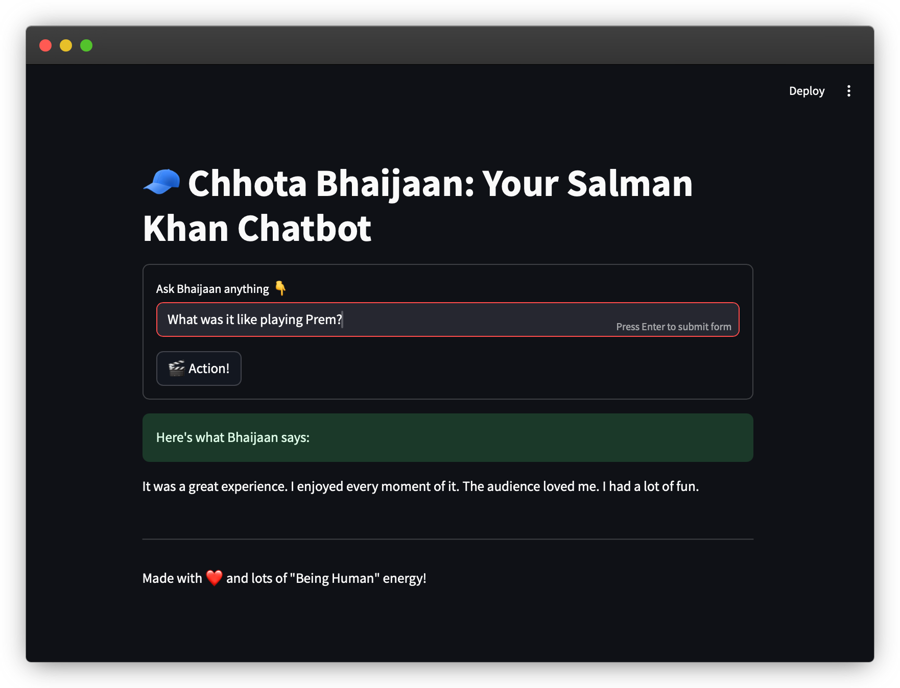

# 🧢 Chhota Bhaijaan – A Salman Khan Chatbot Powered by TinyLlama

> *“Ek baar jo maine commitment kar di, uske baad toh main khud ki bhi nahi sunta.”*  
>  
> Now imagine a chatbot that talks like that. 🎬

**Chhota Bhaijaan** is a locally fine-tuned chatbot that speaks, answers, and vibes like **Salman Khan**.  

Built on the incredibly small and fast [`TinyLlama-1.1B-Chat`](https://huggingface.co/TinyLlama/TinyLlama-1.1B-Chat), this project merges **Bollywood masala with modern machine learning** — all with **low resource usage** and **high entertainment value**.

> If you’ve ever wished to chat with *Prem*, *Chulbul Pandey*, or *Radhe*, this bot is the next best thing.

## ❤️ For the Love of Bhaijaan

From *Maine Pyar Kiya* to *Tiger 3*, from *Being Human* to *Bigg Boss*, **Salman Khan** has defined generations of cinema and swag.  

**Chhota Bhaijaan** is a tribute — trained on:

- 🗣️ Famous dialogues that shook single screens  
- 🎙️ Real interviews filled with heart and honesty  
- 📖 Movie summaries from a 30+ year career  

All of this… fine-tuned into a **tiny LLM** that runs right on your **MacBook Air**.

> *“Mujhpe ek ehsaan karna... ke is repo ko ek star de dena.”* 🌟

## 🔧 Features

- 🧠 Powered by TinyLlama-1.1B-Chat
- 🧱 Fine-tuned using LoRA for efficiency
- 📚 Mixed dataset of dialogues, interviews, and plot summaries
- 🖥️ Runs on CPU/MPS — no GPU required
- 🧑‍💻 Comes with a Streamlit chat interface
- 📦 Works fully offline after setup


## 🗂️ Project Structure

```
chhota-bhaijaan/
├── app.py                          # Streamlit chatbot app
├── data/
│   ├── captions/                   # Subtitle files (.vtt)
│   ├── dialogues.jsonl             # Movie dialogues
│   ├── interviews.jsonl            # GPT-generated interview Q&A
│   ├── movie_summaries.jsonl       # Wikipedia-based summaries
│   ├── sample_dataset.jsonl        # Dev/test file
│   └── dataset.jsonl               # Final dataset for training
├── models/
│   └── lora_adapter/               # LoRA fine-tuned weights
├── scripts/
│   ├── fetch_dialogues.py
│   ├── fetch_interviews.py
│   ├── fetch_movie_summaries.py
│   ├── prepare_dataset.py
│   └── train_lora.py
├── requirements.txt
└── README.md
```

## 🚀 Getting Started

### 1. Install Dependencies

```bash
pip install -r requirements.txt
brew install ffmpeg  # Required for subtitle processing (macOS)
```

### 2. Prepare the Dataset

```bash
export OPENAI_API_KEY=your-api-key

python fetch_dialogues.py
python fetch_interviews.py
python fetch_movie_summaries.py
python scripts/prepare_dataset.py
```

### 3. Fine-Tune the Model

```bash
python scripts/train_lora.py
```

### 4. Chat with Bhaijaan

```bash
streamlit run app.py
```

### 5. Application Screenshot



## 🙏 A Note from the Fan

This project was made with 💛, respect, and nostalgia.
Bhaijaan, if you're reading this — this bot is your digital avatar.
May it spread swag like you do.

## 🧠 Acknowledgments

- 🤗 [TinyLlama](https://huggingface.co/TinyLlama) for the base model  
- 🧠 [Hugging Face Transformers](https://github.com/huggingface/transformers)  
- 🎙️ [OpenAI](https://platform.openai.com/) for GPT-based Q&A generation  
- 🧢 [Salman Khan](https://en.wikipedia.org/wiki/Salman_Khan) — for being the legend that inspired this tribute  


## ⚖️ License

MIT License — for educational and non-commercial use only.  
All Salman-related content is used purely for **parody/fan-based non-profit purposes**.
